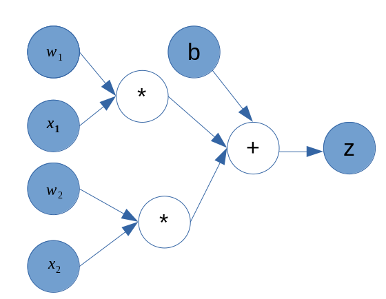

# autograd-cpp

autograd-cpp is a minimalistic autograd engine that implements backpropagation using a directed acyclic graph that operates on scalar values.



```c++
#include <iostream>

#include <autograd/scalar.hpp>

using namespace autograd;

int main() {
    auto w1 = make_shared<Scalar>(2.0);
    auto x1 = make_shared<Scalar>(3.0);
    auto w2 = make_shared<Scalar>(4.0);
    auto x2 = make_shared<Scalar>(4.0);
    auto b = make_shared<Scalar>(1.0);

    auto t1 = w1 * x1;
    auto t2 = w2 * x2;

    auto z = t1 + t2 + b;

    std::cout << "forward pass:" << std::endl;

    std::cout << "w1: " << w1->data() << std::endl;
    std::cout << "x1: " << x1->data() << std::endl;
    std::cout << "w2: " << w2->data() << std::endl;
    std::cout << "x2: " << x2->data() << std::endl;
    std::cout << " b: " << b->data() << std::endl;

    std::cout << "t1: " << t1->data() << std::endl;
    std::cout << "t2: " << t2->data() << std::endl;

    std::cout << " z: " << z->data() << std::endl;

    std::cout << "gradients:" << std::endl;

    z->backward();

    std::cout << "w1: " << *w1 << std::endl;
    std::cout << "x1: " << *x1 << std::endl;
    std::cout << "w2: " << *w2 << std::endl;
    std::cout << "x1: " << *x1 << std::endl;

    std::cout << "t1: " << *t1 << std::endl;
    std::cout << "t2: " << *t2 << std::endl;

    return 0;
}
```